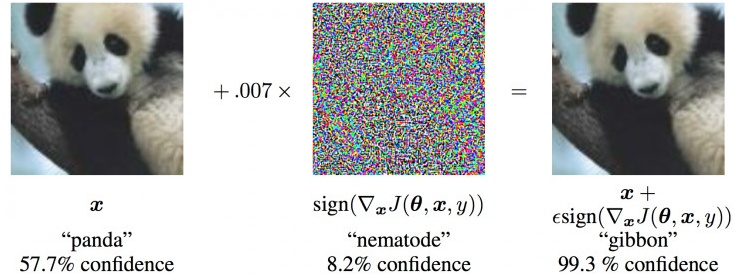

# 数据学习模型中的安全问题

目前机器学习领域中关注的比较多的还是如何构造一个新的模型/新的算法，来更好的完成基于特定场景的特定任务，如分类、识别、检测等任务。

但是机器学习中的安全问题目前的热度还不是很高，虽然已经有一部分的论文出现，但是从总体的数量上来看还不是特别庞大。可以说是一个很有前景的研究领域。

主要参考的是下面这两篇文章：
* [机器学习模型安全与隐私](https://zhuanlan.zhihu.com/p/32719420)
    - 很全面，介绍了很多详细的安全问题
* [AI 领域未来几年最引人注目的方向是什么](https://weibo.com/ttarticle/p/show?id=2309404306246156056409#_0)
    - 主要是讲`adversarial attack`

那么 Machine Learning 中的安全和隐私问题到底是什么呢？
* 安全问题可能发生在`学习阶段`，也可能发生在`推理预测阶段`。
* 攻击者通过某种手段可以窃取到模型里面的某些构件
* 攻击者窃取模型的参数
* 攻击者窃取模型本身
* 攻击者破坏模型的`保密性`(模型所用到的隐私数据不能被窃取，如病患数据)、`完整性`(模型是否能够按照预期工作)、`可用性`(模型是否可以正常工作，不至于崩溃)

对于模型的`完整性`，可以有两种攻击方式：
1. 在学习阶段：**数据下毒**，通过往数据集中添加恶意数据，或者是修改原始数据，从而破坏模型的训练，影响预测结果；
2. 在推理预测阶段：**对抗攻击**，通过在原始数据样本中添加一些小小的扰动，进而破坏模型的预测输出。

那么 machine learning 中存在的安全问题主要是什么呢？
+ **数据萃取**：就是窃取原始的数据集。怎么做到的呢？攻击者可以调用模型的预测API接口，通过多次的调用，攻击者可以得到一系列的`(x, f(x))`，进而可以利用这些数据训练一个和原模型(`model或者f(x)`)近似的模型(`model'或者f'(x)`)，这样再通过API调用得到的结果，可以使用模型`f'(x)`反推出`x'`，使用这个`x'`来近似代替`x`，这样攻击者就得到了近似的原始数据集；
+ **模型萃取**：就是窃取模型本身。一个简单的例子是多元线性回归模型，我们可以使用`n+1`次的预测 API 调用，得到 `n+1` 个参数方程，接下来的任务就是解方程，最终得到这个线性模型的参数，也就窃取了这个模型本身。
+ **对抗样例攻击**：就是在原样本中加入一些微小的扰动(或者说加入一些噪声)，破坏模型的预测结果。最典型的例子是下面这张图，在原始图片中加入一些噪声(*当然要保证这些添加这些噪声后不会影响人眼的观察*)，模型预测的结果就完全不同了，并且错误预测的置性度还相当高。

    
    关于如何构造对抗样例，也有很多的方法，目前还不是特别了解，后续再学习。